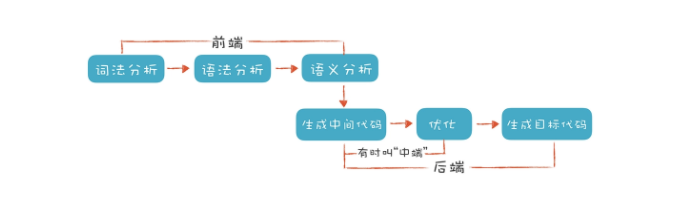

# 编译原理
## 编译器的前端技术


编译器的“前端”技术分为词法分析、语法分析和语义分析三个部分:
- 词法分析是把程序分割成一个个 Token 的过程，可以通过构造有限自动机来实现。
- 语法分析是把程序的结构识别出来，并形成一棵便于由计算机处理的抽象语法树。可以用递归下降的算法来实现。
- 语义分析是消除语义模糊，生成一些属性信息，让计算机能够依据这些信息生成目标代码。

## 正则文法和有限自动机
词法原理 : 依据构造好的有限自动机，在不同的状态中迁移，从而解析出 Token 来

要实现一个词法分析器，首先需要写出每个词法的正则表达式，并画出有限自动机，之后，只要用代码表示这种状态迁移过程就可以了。

## 语法分析
### 公式计算器
把变量声明语句的规则，用形式化的方法表达一下。它的左边是一个非终结符（Non-terminal）。右边是它的产生式（Production Rule）。在语法解析的过程中，左边会被右边替代。如果替代之后还有非终结符，那么继续这个替代过程，直到最后全部都是终结符（Terminal），也就是 Token。只有终结符才可以成为 AST 的叶子节点。这个过程，也叫做推导（Derivation）过程：
```regexp
intDeclaration : Int Identifier ('=' additiveExpression)?;
```
“下降”的含义:上级文法嵌套下级文法，上级的算法调用下级的算法。表现在生成 AST 中，上级算法生成上级节点，下级算法生成下级节点

上下文无关文法: 正则文法是上下文无关文法的一个子集。它们的区别呢，就是上下文无关文法允许递归调用，而正则文法不允许。上下文无关的意思是，无论在任何情况下，文法的推导规则都是一样的

- 初步了解上下文无关文法，知道它能表达主流的计算机语言，以及与正则文法的区别。 
- 理解递归下降算法中的“下降”和“递归”两个特点。它跟文法规则基本上是同构的，通过文法一定能写出算法。
- 通过遍历 AST 对表达式求值，加深对计算机程序执行机制的理解。

### 解决二元表达式中的难点
- 左递归：在二元表达式的语法规则中，如果产生式的第一个元素是它自身，那么程序就会无限地递归下去，这种情况就叫做左递归
- 优先级：具体语言定义的优先级
```regexp
exp -> or | or = exp
or -> and | or || and
and -> equal | and && equal
equal -> rel | equal == rel | equal != rel
rel -> add | rel > add | rel < add | rel >= add | rel <= add
add -> mul | add + mul | add - mul 
mul -> pri | mul * pri | mul / pri
pri -> id | Literal | (exp)
```
- 结合性：就是数学中的结合律

巴科斯范式(BNF):
```regexp
add ::= mul | add + mul
mul ::= pri | mul * pri
pri ::= Id | Num | (add)
```

扩展巴科斯范式(EBNF): 类似正则表达式的一些写法
```regexp
add -> mul ('+' mul)*
```

如何消除左递归：
- 递归下降算法不能处理左递归
- 消除左递归，用一个标准的方法，就能够把左递归文法改写成非左递归的文法
```regexp
将
add -> mul | add + mul
推导为
add -> mul add'
add' -> + mul add' | ε
继续推导为
add -> mul ('+' mul)*
```
伪代码：
```java
mul();
while(next token is +){ 
    mul();
    createAddNode;
}
```

- 优先级是通过在语法推导中的层次来决定的，优先级越低的，越先尝试推导。
- 结合性是跟左递归还是右递归有关的，左递归导致左结合，右递归导致右结合。
- 左递归可以通过改写语法规则来避免，而改写后的语法又可以表达成简洁的 EBNF 格式，从而启发我们用循环代替右递归。